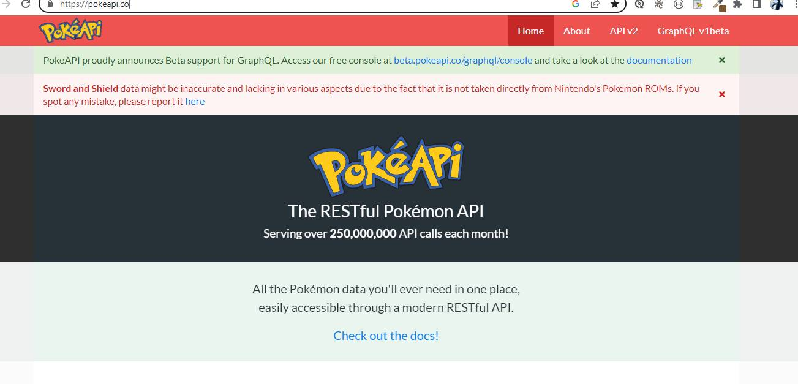
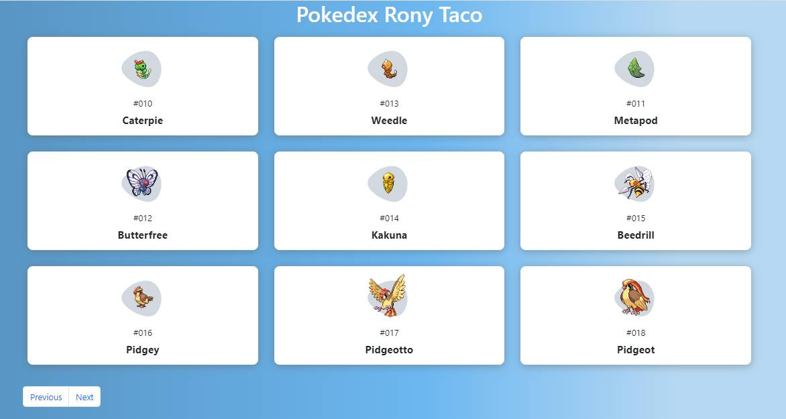

# POKEDEX API

How to fetch data from an Poke API using JavaScript.

## STACK TECH :wrench: :hammer:

* HTML 5
* CSS 3
* GOOGLE FONTS
* CSS GRID
* JAVASCRIPT
* FETCH
* POKE API  https://pokeapi.co/
* BOOTSTRAP 5

# SCREENSHOT

